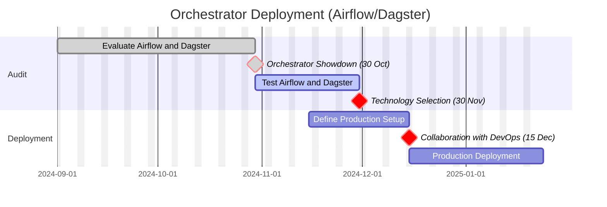

# Orchestrator Deployment Project (Airflow vs Dagster)

This project aims to compare and deploy a workflow orchestrator to automate and manage data pipelines. The primary options under consideration are **Apache Airflow** and **Dagster**. The project consists of several phases, including an initial assessment of the technologies, the final selection of the solution, and deployment with the support of the DevOps team.

## Context and Objectives

The main objective is to select the solution best suited to the team’s data orchestration needs and deploy it into production by the end of January. The project includes the following phases:

- **Technical Audit**: Evaluation of both Airflow and Dagster.
- **Technology Choice**: Final decision based on the audit results.
- **Deployment**: Setup of the infrastructure with DevOps collaboration.

## Project Gantt Chart

The Gantt chart below outlines the project’s key steps, including the evaluation period, technology choice, and deployment. Major tasks are structured to show dependencies with the DevOps team.



## Airflow vs Dagster Comparison

Each orchestrator has distinct strengths and specific use cases. Here is a summary of the main features of each solution:
- [Presentation: Orchestrator Showdown](https://docs.google.com/presentation/d/1P5Y6hefD4SG7CnM4_3qanHRWPJ4pdUjnZhobzDcrHgQ/edit#slide=id.p)

### Apache Airflow

- **Documentation**: [Apache Airflow Documentation](https://airflow.apache.org/docs/)
- **Key Features**: Ideal for task orchestration using DAGs (Directed Acyclic Graphs) with extensive integration support.
- **Advantages**: Large community, robust for traditional ETL pipelines, flexible integrations with other services.
- **Disadvantages**: Complex dependency management in large workflows, limited performance for real-time executions.

### Dagster

- **Documentation**: [Dagster Documentation](https://docs.dagster.io/)
- **Key Features**: Focuses on data management with integrated support for versioned data and a product-oriented approach.
- **Advantages**: Data-oriented, granular asset tracking, strong integration with data science tools.
- **Disadvantages**: Smaller community, fewer native connectors than Airflow, learning curve for teams familiar with Airflow.

## Directory Structure

The project includes two main directories for the PoCs, each testing Airflow and Dagster with specific configurations and pipeline examples.

```
├── README.md                    # This README file
├── airflow/                     # Folder for the Apache Airflow PoC
│   ├── dags/                    # Airflow DAGs and configurations
│   └── README.md                # Documentation on Airflow setup
└── dagster/                     # Folder for the Dagster PoC
    ├── README.md                # Documentation on Dagster setup
    ├── pipelines/               # Dagster pipelines and configurations
    └── README.md                # Documentation on Dagster setup
```


## Additional Resources

- [Airflow vs. Dagster Comparison - Medium Article](https://dev.to/chaets/airflow-vs-dagster-orchestration-story-for-your-data-platform-3pko)
- [Airflow vs. Dagster: Orchestration Story for your Data Platform ](https://medium.com/codex/dagster-vs-apache-airflow-side-by-side-comparison-965149997cee)
- [Airflow, Dagster, Sage Comparison - Medium Article](https://towardsdatascience.com/airflow-prefect-and-dagster-an-inside-look-6074781c9b77)
- [Airflow and DAG Pipelines](https://airflow.apache.org/docs/stable/dags.html)
- [Dagster and Data Asset Management](https://docs.dagster.io/concepts/assets/software-defined-assets)
